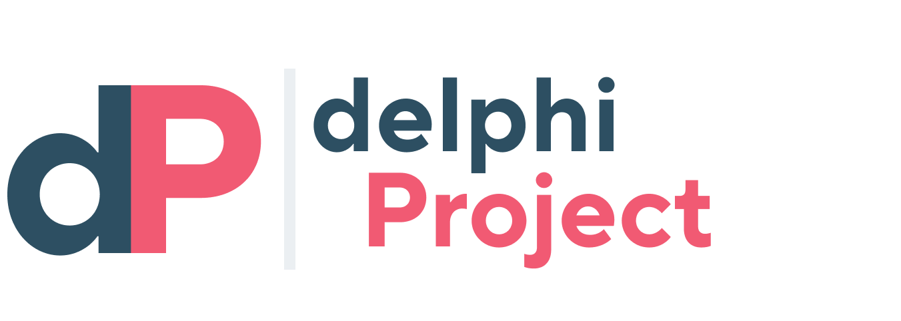
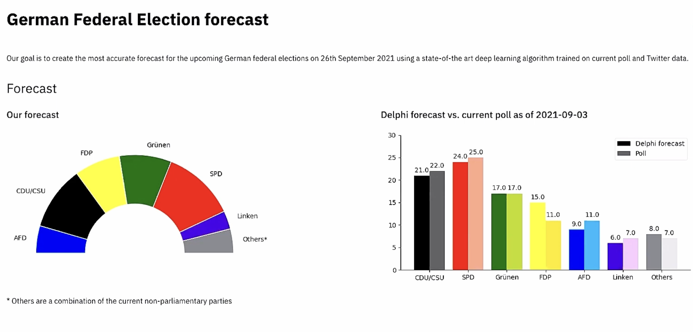
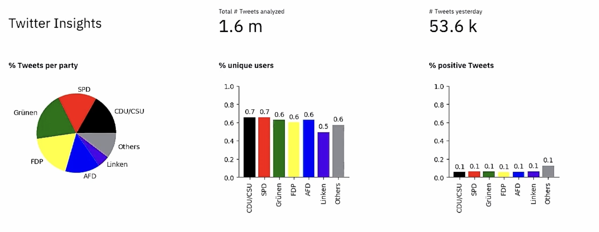

# Project Delphi: German Federal Election Forecast

<p align="center">
  
</p>

## Overview

Project Delphi is an end-to-end Machine Learning data product that forecasts the outcomes of the 2021 German Federal Election. It combines traditional polling data with real-time sentiment analysis from Twitter to provide an interactive, state-of-the-art prediction dashboard.

## Features

- **Interactive Dashboard:** Built with Streamlit to visualize election forecasts seamlessly.
- **Deep Learning Sentiment Analysis:** Uses a fine-tuned model to analyze political sentiment from thousands of tweets daily.
- **Data Pipeline:** Automated data scraping via the Twitter API and polling aggregators, orchestrated on Google Cloud Platform.
- **REST API:** Serves model predictions and engineered features using FastAPI.

## Architecture

1. **Data Collection**: Scripts pull polling data (DAWUM API) and thousands of tweets (Twitter API).
2. **Model Training & Inference**: A deep learning model predicts political sentiment, outputting key metrics (positive/negative share, retweet likelihood).
3. **Cloud Storage**: Processed metrics are stored in Google Cloud Storage (GCS).
4. **Presentation**: A Streamlit application reads from GCS to serve up-to-date visual forecasts.

## Tech Stack

- **Languages:** Python
- **Machine Learning & NLP:** TensorFlow, Scikit-learn, GermanSentiment
- **Web App & API:** Streamlit, FastAPI, Uvicorn
- **Cloud Infrastructure:** Google Cloud Platform (Storage, AI Platform), Docker

## Dashboard Preview

<p align="center">
  
  
</p>

## Installation and Setup

### Prerequisites

Ensure you have Python 3.8+ installed.

### Setup

1. **Clone the repository:**
   ```bash
   git clone https://github.com/nicolasbuhringer/delphi_project.git
   cd delphi_project
   ```

2. **Install dependencies:**
   ```bash
   pip install -r requirements.txt
   ```

3. **Run the Streamlit Dashboard locally:**
   ```bash
   streamlit run app.py
   ```

4. **Run the FastAPI server locally:**
   ```bash
   uvicorn api.fast:app --reload
   ```

## Repository Structure

- `app.py`: Main Streamlit application.
- `api/`: FastAPI routes and configuration.
- `project_delphi/`: Core Python package for data collection, pre-processing, and modeling.
- `scripts/`: Utility scripts for project execution.
- `tests/`: Unit tests setup.

## Let's Connect
Feel free to reach out if you have questions about the implementation or methodology used in Project Delphi.
